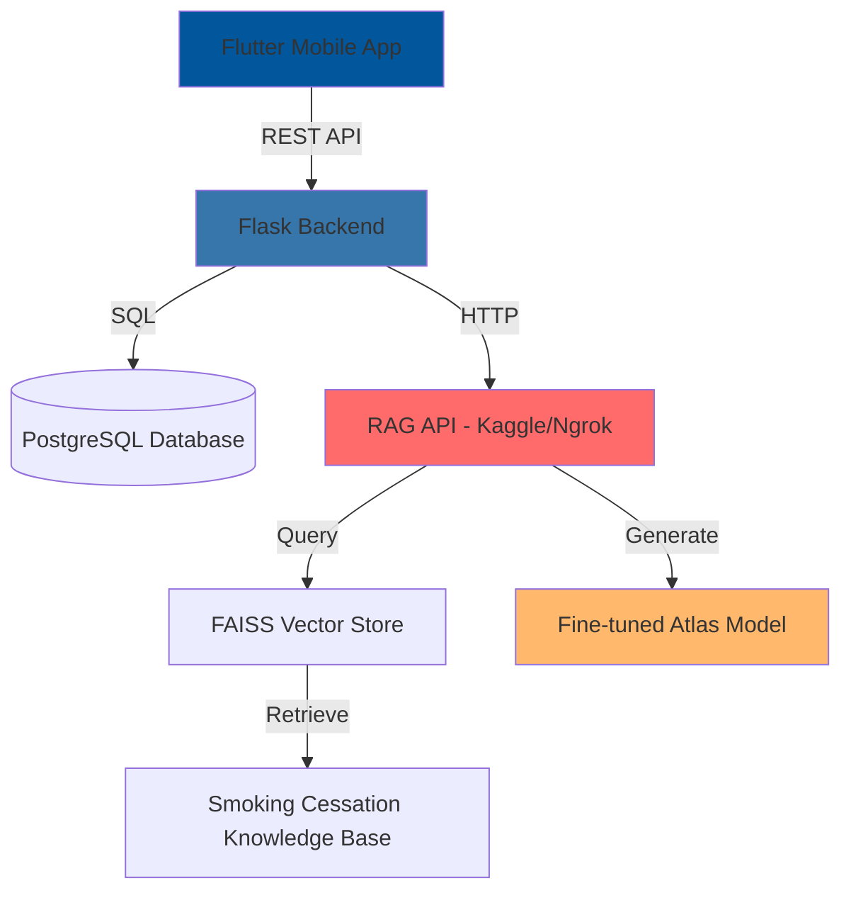
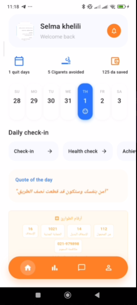
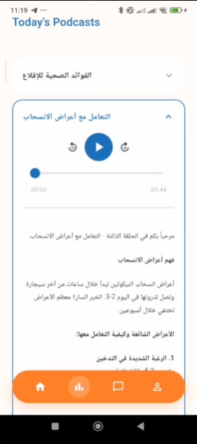
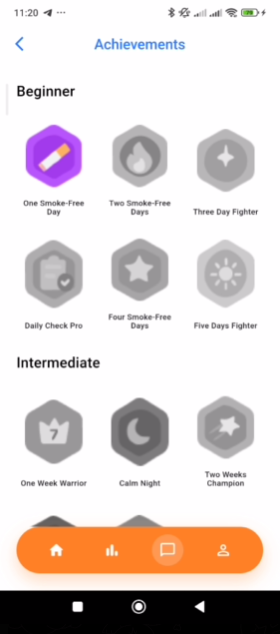

<div align="center">


# 🚭 SAI - Smoking Cessation Support App

### AI-Powered Mental Health & Smoking Cessation Platform
*Leveraging NLP, RAG, and Fine-tuned Language Models for Arabic-speaking users*

<!--  -->

[](https://flutter.dev)
[](https://python.org)
[](https://postgresql.org)
[](https://huggingface.co/models)

[Features](#-key-features) • [Architecture](#-architecture) • [ML/NLP](#-mlnlp-innovations) • [Setup](#-quick-start) • [Demo](#-demo)

</div>

---

## 📖 About

**SAI** is an intelligent mobile application designed to support smoking cessation for Arabic-speaking users. The app combines behavioral tracking, personalized content, and an AI-powered chatbot to provide comprehensive support throughout the quitting journey.

### 🎯 Problem Statement
Smoking cessation apps often lack:
- **Arabic language support** with proper dialectal understanding
- **Intelligent conversational AI** that understands context and intent
- **Personalized, evidence-based** content delivery
- **Holistic mental health** tracking alongside cessation progress

### 💡 Solution
SAI addresses these gaps through:
- **Fine-tuned Arabic LLM** (Atlas model with LoRA) trained on smoking cessation data
- **RAG-powered chatbot** with semantic search and intent classification
- **Multi-modal tracking** (mood, sleep, cravings, smoking frequency)
- **Interactive podcasts** in Darija (Algerian Arabic)
- **Achievement system** to maintain user motivation

---

## ✨ Key Features

### 🤖 AI Chatbot (Sai)
- **Retrieval-Augmented Generation (RAG)** with FAISS vector database
- **Intent classification** (greetings, smoking queries, mental health, off-topic)
- **Semantic similarity matching** for relevant content retrieval
- **Dynamic token allocation** based on query complexity
- **Anti-hallucination measures** with confidence scoring
- **Persistent chat history** with session management

### 📊 Daily Check-in System
- Mood tracking with visual indicators
- Sleep quality monitoring
- Smoking frequency recording
- Craving intensity assessment
- Historical data visualization with calendar view

### 🎧 Interactive Podcasts
- Curated smoking cessation content in Arabic
- Audio playback with progress tracking
- Categorized by topics (motivation, health, strategies)
- Offline access capability

### 🏆 Achievements & Gamification
- Milestone-based achievements (7 days, 30 days, 100 days smoke-free)
- Mood consistency badges
- Chat engagement rewards
- Progress visualization

### 📅 Calendar View
- Visual mood indicators for each day
- Smoking frequency heatmap
- Quick access to daily check-in history

---

## 🏗️ Architecture



### 🗂️ Project Structure
```
sai-nlp-project/
├── backend/                    # Flask REST API
│   ├── app/
│   │   ├── models/            # SQLAlchemy models (User, CheckIn, Chat, etc.)
│   │   ├── routes/            # API endpoints
│   │   └── utils/             # Helper functions
│   ├── migrations/            # Alembic database migrations
│   └── run.py                 # Application entry point
│
├── flutter-app/               # Flutter mobile application
│   ├── lib/
│   │   ├── core/             # Networking, constants, themes
│   │   ├── features/
│   │   │   ├── chatbot/      # RAG-powered chat interface
│   │   │   ├── checkin/      # Daily tracking
│   │   │   ├── podcasts/     # Audio content
│   │   │   ├── achievements/ # Gamification
│   │   │   └── calendar/     # Historical view
│   │   └── main.dart
│   └── assets/               # Images, icons, audio files
│
└── notebooks/                 # ML/NLP research & development
    ├── atlas-fine-tuning-lora-16.ipynb  # LoRA fine-tuning pipeline
    └── atlas-rag-final.ipynb            # RAG implementation
```

---

## 🧠 ML/NLP Innovations

### 1. Fine-tuned Language Model

**Model:** [Atlas-Chat-2B](https://huggingface.co/MBZUAI-Paris/Atlas-Chat-2B) with LoRA (Low-Rank Adaptation)

**Training Details:**
- **Base Model:** MBZUAI-Paris/Atlas-Chat-2B (2B parameters)
- **Dataset:** 14,000+ manually validated conversations (QA, greetings, boundaries, profanity handling)
- **Validation:** Student-reviewed for quality assurance across multiple interaction types
- **Strategy:** Single shuffled dataset to prevent catastrophic forgetting
- **Fine-Tuning:** LoRA (r=16, alpha=32) with 8-bit quantization
- **Hyperparameters:** 3 epochs, LR=2e-4, batch_size=2, gradient_accum=4
- **Evaluation:** 10% split, evaluated on eval_loss metric

**Notebook:** [`notebooks/atlas-fine-tuning-lora-16.ipynb`](notebooks/atlas-fine-tuning-lora-16.ipynb)

### 2. RAG (Retrieval-Augmented Generation) System

**Components:**
- **Vector Store:** FAISS with sentence-transformers embeddings
- **Knowledge Base:** 620 expert-curated documents from medical journals, books, multimedia, and social content
- **Coverage:** Smoking cessation strategies, mental health support, coping mechanisms, relapse prevention
- **Retriever:** Top-k similarity search with configurable threshold
- **Generator:** Fine-tuned Atlas model with retrieved context

**Pipeline:**
1. **Intent Classification:** Categorize query type
2. **Semantic Search:** Retrieve relevant documents from FAISS
3. **Context Ranking:** Score by cosine similarity
4. **Token Budget Management:** Dynamically allocate context length
5. **Generation:** Produce grounded, contextual response
6. **Confidence Scoring:** Validate output quality

**Notebook:** [`notebooks/atlas-rag-final.ipynb`](notebooks/atlas-rag-final.ipynb)

### 3. Intent Classification
- Multi-label classification for user queries
- Categories: `greeting`, `smoking_question`, `mental_health`, `motivation`, `off_topic`
- Rule-based + semantic similarity hybrid approach

### 4. Anti-Hallucination Measures
- Source attribution for all RAG responses
- Confidence thresholding (reject low-confidence generations)
- Fallback to retrieval-only for uncertain queries
- Metadata tracking (query type, sources used, confidence score)

---

## 🚀 Quick Start

### Prerequisites
- Python 3.11+
- PostgreSQL 14+
- Flutter SDK 3.0+
- Conda (recommended)
- Git

## Backend Setup

### 1. Create Conda Environment
```bash
conda create -n sai python=3.11
conda activate sai
```

### 2. Install Python Dependencies
```bash
cd backend/sai_backend
pip install flask flask-sqlalchemy flask-migrate flask-cors psycopg2-binary python-dotenv
```

### 3. Setup PostgreSQL Database
- Open pgAdmin
- Create a new database named `sai`
- Username: `postgres`
- Password: `12345678`
- Port: `5432`

### 4. Run Database Migrations
```bash
flask db upgrade
```

### 5. Start Backend Server
```bash
python run.py
```
Backend will run on `http://127.0.0.1:5000`

## Frontend Setup

### 1. Install Flutter Dependencies
```bash
cd flutter-app
flutter pub get
```

### 2. Update Backend URL
- Open `lib/core/network/url_data.dart`
- Set `BASE_URL` to your local IP address: `http://YOUR_IP:5000`
- Find your IP: `ipconfig` (Windows) or `ifconfig` (Mac/Linux)

### 3. Run Flutter App
```bash
flutter run
```

---

## 🎬 Demo

### 📱 Screenshots

<div align="center">

| Onboarding | Home Screen | Chat Interface |
|:----------:|:-----------:|:--------------:|
|  |  |  |

| Daily Check-in (Mood) | Daily Check-in (Sleep) | Daily Check-in (Smoking) |
|:---------------------:|:----------------------:|:------------------------:|
|  |  |  |

| Podcasts | Achievements |
|:--------:|:------------:|
|  |  |

</div>

### 🎥 Features Showcase

**✨ Key Highlights:**
- 🌙 Smooth animated onboarding with floating clouds
- 🤖 Intelligent RAG-powered chatbot with Arabic support
- 📊 Comprehensive daily tracking (mood, sleep, smoking, cravings)
- 🎧 Interactive Arabic podcasts on smoking cessation
- 🏆 Gamified achievement system to maintain motivation
- 📅 Calendar view with visual mood indicators

### Video Walkthrough
*Add your demo video link here when ready*

---

## 🔧 Tech Stack

### Frontend
- **Framework:** Flutter 3.0+
- **State Management:** Provider
- **Networking:** Dio
- **Storage:** Flutter Secure Storage, Shared Preferences
- **Audio:** Just Audio
- **UI:** Material Design 3

### Backend
- **Framework:** Flask 2.3
- **ORM:** SQLAlchemy
- **Migrations:** Alembic
- **Database:** PostgreSQL 14
- **API:** RESTful with CORS support

### ML/NLP
- **Model:** Fine-tuned Atlas (Arabic LLM)
- **Fine-tuning:** LoRA (Low-Rank Adaptation)
- **Vector Store:** FAISS
- **Embeddings:** sentence-transformers
- **Framework:** PyTorch, Transformers (HuggingFace)
- **Deployment:** Kaggle + Ngrok (development), Flask API (production-ready)

---

## 📊 Database Schema

### Core Tables
- `users` - User accounts and profiles
- `daily_check_ins` - Mood, sleep, smoking tracking
- `chat_sessions` - Conversation threads
- `chat_messages` - Individual messages with RAG metadata
- `podcasts` - Audio content library
- `user_achievements` - Unlocked badges and milestones

---

## 🧪 Testing the RAG System

### 1. Start RAG API
```bash
# Open notebooks/atlas-rag-final.ipynb in Kaggle
# Run Cell 22 to start the API
# Copy the ngrok URL
```

### 2. Update Backend Configuration
```python
# In backend/app/routes/chat.py
RAG_API_URL = 'https://your-ngrok-url.ngrok-free.dev/query'
```

### 3. Test Queries
```bash
# Greeting in Arabic
"السلام عليكم"  # Should return contextual greeting

# Smoking cessation question
" علاش مهم نقلع عن التدخين؟"  # Should use RAG with high confidence

# Off-topic
"واش رايك في كرة القدم؟"  # Should politely deflect
```

---

## 📚 Documentation

- [Integration Guide](INTEGRATION_GUIDE.md) - Connect RAG API to Flutter
- [Database Setup](DATABASE_CHAT_SETUP.md) - Chat history & persistence
- [Fine-tuning Notebook](notebooks/atlas-fine-tuning-lora-16.ipynb) - Model training
- [RAG Notebook](notebooks/atlas-rag-final.ipynb) - RAG implementation

---

## 🎓 Academic Context

This project was developed as part of an NLP course final project, demonstrating:

✅ **Transfer Learning** - Fine-tuning pre-trained models for domain-specific tasks  
✅ **Retrieval-Augmented Generation** - Combining retrieval and generation  
✅ **Low-Resource NLP** - Working with Arabic dialectal data  
✅ **Intent Classification** - Multi-label query understanding  
✅ **Vector Databases** - Semantic search with FAISS  
✅ **Full-Stack Integration** - Connecting ML models to production apps  
✅ **Anti-Hallucination** - Techniques to reduce LLM hallucinations  

---

## 🚧 Future Enhancements

- [ ] Deploy RAG API to production server (replace ngrok)
- [ ] Add voice input/output for chatbot
- [ ] Implement push notifications for check-in reminders
- [ ] Multi-user social features (support groups)
- [ ] Expand podcast library with user-generated content
- [ ] iOS deployment (currently Android-focused)
- [ ] Offline mode with local model inference
- [ ] Integration with wearable devices for health metrics

---

## 👥 Contributors

**Selma khelili** - [GitHub](https://github.com/Selmakhelili) • [LinkedIn](https://linkedin.com/in/selma-student-khelili-06b924353)

---

## 📄 License

This project is developed for academic purposes.

---

## 🙏 Acknowledgments

- **Atlas Model** - Pre-trained Arabic language model
- **HuggingFace** - Transformers library and model hosting
- **FAISS** - Efficient similarity search
- **Flutter Community** - UI components and packages

---

## 📧 Contact

For questions or collaboration:
- **Email:** selma.khelili@ensia.edu.dz
- **Project Report:** [https://drive.google.com/file/d/1dt9IWN00euiX--AnPozTY9Fsthwi5akj/view?usp=sharing]

---

<div align="center">

**⭐ If you found this helpful, please consider giving it a star!**

Made with ❤️ for the Arabic-speaking community

</div>
